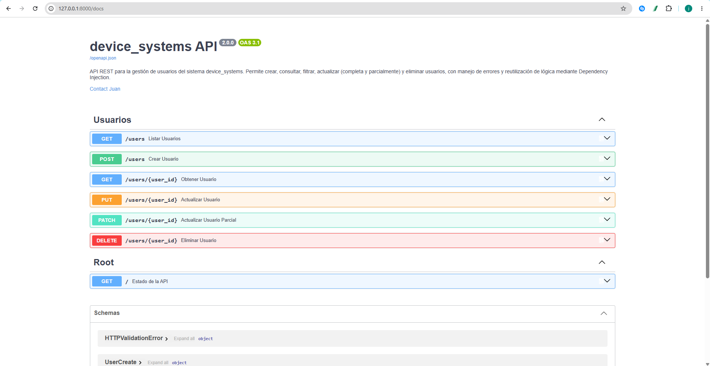
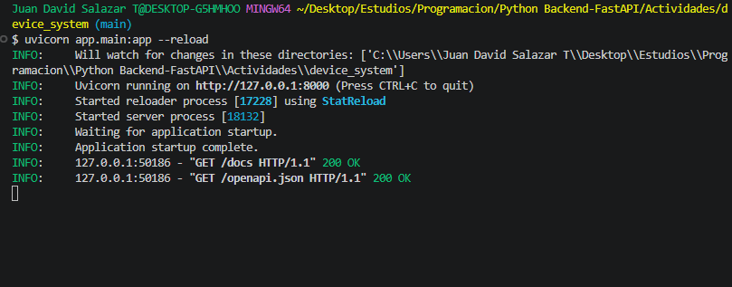
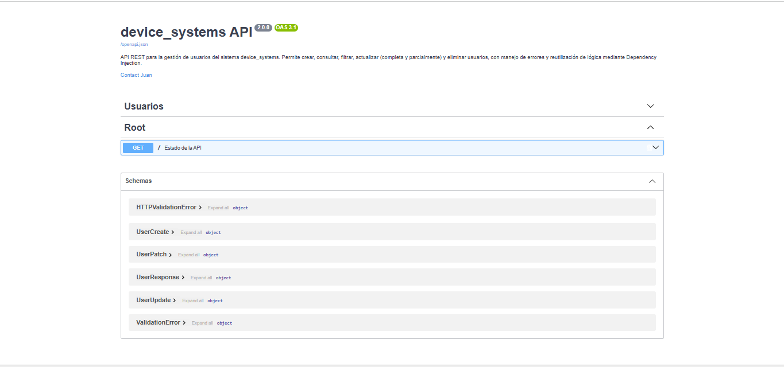
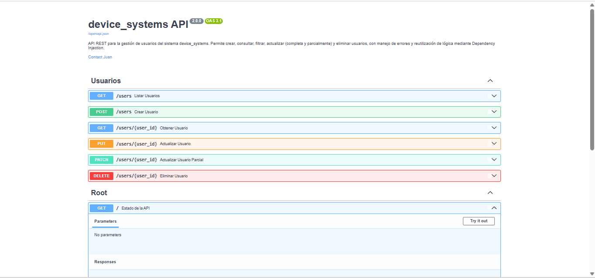

-NOMBRE DEL PROYECTO : device_system

Esta es la segunda versión de mi API de gestión de usuarios, hecha con FastAPI. En la actividad anterior armé lo básico: un par de endpoints GET y uno de POST para crear usuarios. Acá la idea fue evolucionar esa base para que la API se comporte como una API "de verdad": que deje actualizar y eliminar usuarios, que responda con los códigos de error correctos cuando algo sale mal, y que reutilice código en lugar de repetir la misma validación en cada endpoint.

Sigue siendo el mismo proyecto, mismo recurso /users, solo que ahora bastante más completo.

---------------------------------------------------------------------------------------------------------
-DESCRIPCION DE LA API

En resumen, /users permite:

Ver la lista completa de usuarios, o filtrarla por rol y por si están activos o no.
Consultar un usuario puntual por su ID.
Crear un usuario nuevo (validando que el correo no esté repetido).
Actualizar un usuario por completo, o solo algunos campos.
Eliminar un usuario (esta acción pedí que llevara un "token" simulado, más abajo explico por qué).
Y ante cualquier cosa que salga mal, responder con un mensaje claro y el código HTTP que corresponde, no un error genérico de servidor.

--------------------------------------------------------------------------------------------------------
-TECNOLOGIAS UTILIZADAS

Python 3.13
FastAPI como framework principal
Uvicorn para levantar el servidor
Pydantic v2 para validar todo lo que entra y sale de la API
Swagger UI y ReDoc, que vienen incluidos gratis con FastAPI y me sirvieron muchísimo para probar cada endpoint sin necesidad de Postman

--------------------------------------------------------------------------------------------------------

INSTALACION DE DEPENDENCIAS

En primer lugar hay que pararse en el proyecto (device_system/).

El otro paso es trabajar con un entorno virtual

python -m venv venv

Y activarlo segun el sistema operativo

venv\Scripts\activate

Yo lo active en Git bash con 

source venv/bin/activate

Con el entorno activado se activan las dependencias

pip install -r requirements.txt

Correr el servidor

uvicorn app.main:app --reload

Una vez arriba ,la API queda disponible 

http://127.0.0.1:8000 -> la API en si

http://127.0.0.1:8000/docs -> Swagger UI 

http://127.0.0.1:8000/redoc -> ReDoc

Endpoints
Qué hace	Método	Ruta	Código esperado
Listar usuarios	GET	/users	200 OK
Filtrar por rol y/o estado	GET	/users?role=admin&is_active=true	200 OK
Consultar un usuario	GET	/users/{user_id}	200 OK / 404 si no existe
Crear usuario	POST	/users	201 Created / 400 / 422
Actualizar completo	PUT	/users/{user_id}	200 OK / 404 / 400
Actualizar parcial	PATCH	/users/{user_id}	200 OK / 404 / 400
Eliminar usuario	DELETE	/users/{user_id}	200 OK / 401 / 404

CODIGOS DE ESTADO QUE MANEJA LA API

Código	Cuándo aparece
200 OK	La operación salió bien (GET, PUT, PATCH o DELETE exitosos)
201 Created	Se creó un usuario nuevo
400 Bad Request	Correo duplicado, rol no permitido, o un PATCH sin ningún campo
401 Unauthorized	Falta el header x-token o el valor no es el correcto
404 Not Found	El user_id que se busca no existe
422 Unprocessable Entity	Los datos enviados no cumplen con lo que pide el modelo (por ejemplo, un correo mal escrito o un campo obligatorio faltante)

CAPTURAS DE SWAGGER UI

SOBRE EL USO DE DEPENDS()

Cuando estaba armando los primeros endpoints, me di cuenta de que estaba repitiendo el mismo bloque de código una y otra vez: buscar el usuario en la lista con un for, y si no aparecía, lanzar el error 404. Lo repetía en el GET por ID, en el PUT, en el PATCH y en el DELETE.

Depends() de FastAPI me sirvió justo para eso: sacar esa lógica repetida a una función aparte (en app/dependencies/user_dependencies.py) y que FastAPI se encargue de "inyectarla" en cada endpoint que la necesite. Así, en vez de repetir el for en cada función, simplemente escribo:

def obtener_usuario(usuario: dict = Depends(obtener_usuario_o_404)):
    return usuario

Y si el usuario no existe, ni siquiera llega a ejecutarse el cuerpo de la función: Depends() ya cortó con el error 404 antes.

Usé el mismo patrón para otras tres cosas que se repetían o que quería mantener separadas:

validar_rol_filtro, para revisar que el rol usado como filtro en el listado sea uno permitido.
obtener_configuracion_api, que simula unos datos generales de configuración.
verificar_token, que revisa el header x-token antes de dejar eliminar un usuario.

En pocas palabras: Depends() me ayudó a no repetir código y a mantener cada endpoint enfocado solo en lo que le corresponde a él.

SOBRE EL MANEJO DE ERRORES

Todos los errores los manejo con HTTPException de FastAPI, y siempre devuelvo la misma forma de respuesta para que sea predecible:

{
  "detail": "mensaje explicando qué pasó"
}

Los casos que cubrí fueron:

Usuario no encontrado, cuando se busca, actualiza o elimina un ID que no existe.
Correo duplicado, tanto al crear un usuario nuevo como al actualizar uno existente con un correo que ya usa otro usuario.
Rol no permitido, si se manda un rol que no está dentro de la lista de roles válidos.
Actualización parcial vacía, si el PATCH llega sin ningún campo para modificar.
Token faltante o inválido, en el DELETE, si no se manda el header x-token correcto.
Datos inválidos en general, esto último no lo manejo yo manualmente: Pydantic ya se encarga de validar tipos de datos, campos obligatorios y formatos (como el correo), y automáticamente responde 422 cuando algo no cuadra.

Siguiente parte

Base de datos

El proyecto utiliza SQLite 

La conexion esta configurada en:

DATABASE_URL = "sqlite:///./app.db"

Al iniciar la aplicacion ,SQLAlchemy crea las tablas definidas en los modelos

La tabla principal utilizada para los usuarios es:

usuarios

Endpoints principales

Obtener usuarios

GET /users

Obtiene la lista de usuarios registrados.

Obtener un usuario

GET /users/{id}

Obtiene un usuario específico mediante su ID.

Ejemplo:

GET /users/1

Crear usuario

POST /users

Ejemplo de datos:

{
  "nombre": "Carlos Rodriguez",
  "email": "carlos.rodriguez@gmail.com",
  "telefono": "3204567890",
  "activo": true,
  "es_admin": false
}

Actualizar usuario

PUT /users/{id}

Actualiza los datos de un usuario existente.

Actualización parcial

PATCH /users/{id}

Permite modificar solamente algunos campos del usuario.

Eliminar usuario

DELETE /users/{id}

Elimina un usuario mediante su ID.

Modelo de usuario

El modelo Usuario contiene los siguientes campos:

Campo             Tipo       Descripción

id              Integer    Identificador único
nombre          String     Nombre del usuario
email           String     Correo electrónico único
telefono        String     Número de teléfono
activo          Boolean    Indica si el usuario está activo
es_admin        Boolean    Indica si tiene permisos de administrador
creado_en       DateTime   Fecha de creación
ultimo_acceso   DateTime   Último acceso del usuario

Flujo básico

Cliente
   │
   ▼
FastAPI
   │
   ▼
Routes
   │
   ▼
Services
   │
   ▼
SQLAlchemy
   │
   ▼
SQLite

Prueba rápida

Después de iniciar el servidor:

Abre http://127.0.0.1:8000/docs.

Busca POST /users.

Pulsa Try it out.

Introduce los datos del usuario.

Pulsa Execute.

Utiliza GET /users para comprobar que el usuario fue registrado.

Imagen de el inicio del programa.

Imagen del Swagger

Todos los endpoints

Se elimino el consumo de datos en memoria para implementar el SQLite
y se ajusto el codigo.

Se borro el archivo users_db.py por consumo en memoria.

TECNOLOGIAS UTILIZADAS

-Python 3.13

-FastAPI

-SQLAlchemy

-SQLite

-Pydantic

-Uvicorn

AUTOR:JUAN DAVID SALAZAR TORRES

JUAN DAVID SALAZAR TORRES

3169901

ANALISIS Y DESARROLLO DE SOFTWARE

SENA (CTMA)

CARLOS NAVIA 

PYTHON AVANZADO

